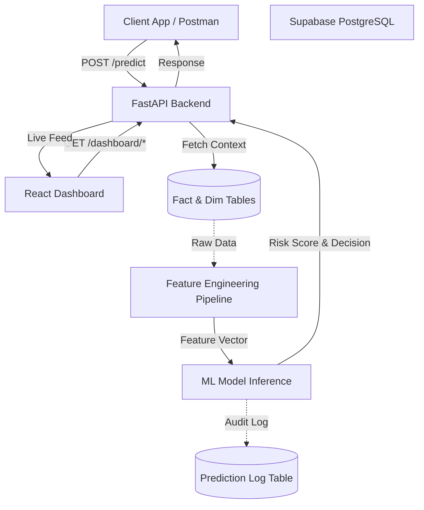

# Live Demo
## https://risk-scoring-platform-9h5e.onrender.com/ui/

# Risk Scoring Platform

Production-style fraud risk scoring platform built with FastAPI, PostgreSQL (via Supabase), and scikit-learn, featuring a modern React frontend with JWT authentication.
It supports:
- Real-time transaction scoring with sub-50ms latency
- Model versioning and metadata registry
- Feature engineering with leakage-safe historical windows
- API + interactive real-time dashboard UI

## Tech Stack
- **Backend**: Python 3.12, FastAPI, SQLAlchemy (Async), Uvicorn
- **Database**: PostgreSQL (hosted on Supabase) with asyncpg
- **Machine Learning**: Scikit-Learn, Pandas, Joblib
- **Frontend**: React, Vite, Recharts, Lucide Icons
- **Deployment**: Render (Web Service), GitHub Actions (optional)

## What Is Achieved

This project successfully implements a complete, end-to-end Machine Learning Operations (MLOps) pipeline and full-stack application:
1. **Real-Time Feature Engineering**: Dynamically computes user and merchant historical aggregations (e.g., velocity, average transaction amounts) at the exact time of the transaction to prevent data leakage.
2. **Production ML Serving**: Wraps a scikit-learn model in a high-performance, asynchronous FastAPI inference service.
3. **Immutable Audit Logging**: Every prediction is logged to a `prediction_log` table with its exact feature snapshot and model version for regulatory compliance and model monitoring.
4. **Resilient Database Architecture**: Implements connection pooling (`pool_pre_ping`) and async SQLAlchemy to gracefully handle serverless database connection limits (Supabase PgBouncer).
5. **Real-Time Dashboard**: A stunning React frontend that polls the backend to display live KPIs, animated Risk Score Trends, and a live feed of recent transactions.

Given a `transaction_id` already stored in the database, the platform:
1. Loads transaction + user + merchant context
2. Builds raw + aggregated risk features
3. Runs a trained model to estimate fraud probability
4. Applies a decision threshold to classify fraud vs legit
5. Logs prediction output for monitoring and analysis

## Live Endpoints

- UI: `https://risk-scoring-platform-9h5e.onrender.com/ui/`
- Health: `https://risk-scoring-platform-9h5e.onrender.com/api/v1/health`
- OpenAPI Docs: `https://risk-scoring-platform-9h5e.onrender.com/docs`

## Architecture & Flow



## Architecture Overview

Core flow:
- `src/main.py`: app startup, model caching, middleware, route wiring, UI mount
- `src/api/routes/predict.py`: `/predict` and `/predict/batch` (Secured with JWT)
- `src/api/routes/auth.py`: `/token` (OAuth2 JWT generation)
- `src/services/prediction_service.py`: orchestration layer (DB fetch -> features -> model -> log)
- `src/services/drift_service.py`: APScheduler job for drift detection and automated retraining
- `src/features/feature_pipeline.py`: feature computation pipeline
- `src/training/train.py`: training + evaluation + artifact persistence
- `models/registry.json`: active model registry

UI:
- `frontend/src/App.jsx`: React frontend with login screen and real-time dashboard
- `frontend/src/index.css`: Tailwind-free vanilla CSS design system
- `frontend/dist/`: Built static assets served by FastAPI

## API Summary

Base path: `/api/v1`

- `GET /health`: liveness/readiness + DB + model state
- `GET /model-info`: active model metadata + metrics
- `GET /models`: model registry listing
- `POST /token`: Obtain JWT token (requires `admin_username` and `admin_password`)
- `POST /predict`: score one transaction (requires JWT)
- `POST /predict/batch`: score multiple transactions (requires JWT)

Example request:

```json
{
  "transaction_id": "fbdd18de-ce99-4466-8a0f-ab5127071e88",
  "include_features": false
}
```

## Recent Enhancements (Step 2 Complete)

### Real-Time Dashboard Integration
The React UI (`frontend/src/App.jsx`) has been fully integrated with live backend data, replacing all hardcoded mock data.
- **KPIs**: Added `Total Volume`, `Processed Txns`, and `Total Fraud Caught` metrics.
- **Risk Score Trends**: Interactive `Recharts` graph plotting the latest model predictions over time.
- **Recent Transactions Feed**: Live scrolling table showing the latest transactions, amounts, and their fraud risk scores.
- **Auto-Refresh**: Dashboard polls the backend every 30 seconds for live updates.

### Backend Dashboard Endpoints (`src/api/routes/dashboard.py`)
- `GET /api/v1/dashboard/stats`: Returns aggregated KPIs.
- `GET /api/v1/dashboard/chart-data`: Returns the 20 most recent predictions for time-series plotting.
- `GET /api/v1/dashboard/recent-transactions`: Returns the 10 latest transactions joined with prediction outcomes.

### Production Deployment Fixes
- **Database Connection Resilience**: Added `pool_pre_ping=True` and `pool_recycle=300` to the SQLAlchemy `async_engine` to gracefully handle Supabase PgBouncer connection drops.
- **PostgreSQL Enum Case Sensitivity**: Fixed a bug where the prediction service failed to query historical transactions because the `txn_status_enum` in the hosted Supabase database expected uppercase values (`COMPLETED`) while the codebase used lowercase strings.
- **Global Error Handling**: Upgraded the FastAPI generic exception handler to output full Python tracebacks in the JSON response to assist with debugging deployed instances.

## Local Setup

### 1) Create and activate virtualenv

```powershell
python -m venv venv
.\venv\Scripts\activate
```

### 2) Install dependencies

```powershell
pip install -r requirements-run.txt
```

### 3) Configure environment

Copy `.env.example` to `.env` and update:
- `DB_HOST`, `DB_PORT`, `DB_NAME`, `DB_USER`, `DB_PASSWORD`
- `SECRET_KEY`
- `ENVIRONMENT` / `DEBUG`

### 4) Run app

```powershell
$env:DEBUG='false'
python -m uvicorn src.main:app --host 127.0.0.1 --port 8000
```

Open:
- UI: `http://127.0.0.1:8000/ui/`
- Docs: `http://127.0.0.1:8000/docs`

## Training & Data

Train model:

```powershell
python scripts/train_model.py
```

Seed data (if needed):

```powershell
python scripts/seed_db.py
```

Smoke test API:

```powershell
python scripts/test_api.py
```

## Deployment (Render)

This repo includes:
- `render.yaml` (Blueprint for web service + free Postgres)
- `DEPLOY_FREE.md` (deployment notes)

Important Render note:
- In production mode, `SECRET_KEY` must not be default.
- `render.yaml` is configured to generate `SECRET_KEY` automatically.

## Repository Notes

- Generated outputs and old artifacts are trimmed to keep deploys and diffs manageable.
- Active model files are kept for runtime startup compatibility.

## License

This project is for educational and demo purposes unless a separate license is added.
